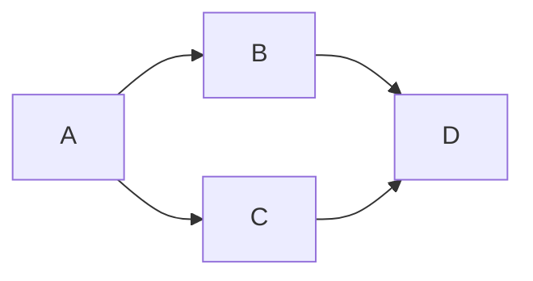

嵌套 navigation 就是在一个 screen component 里面嵌套一个 navigator，嵌套 navigation
和组件嵌套一样，因为它本身也是 React Component。

    function Home() {
        return (
            <Tab.Navigator>
                <Tab.Screen name="Feed" component={Feed} />
                <Tab.Screen name="Messages" component={Messages} />
            </Tab.Navigator>
        );
    }

    function App() {
        return (
            <NavigationContainer>
                <Stack.Navigator>
                    <Stack.Screen
                        name="Home"
                        component={Home}
                        options={{ headerShown: false }}
                    />
                    <Stack.Screen name="Profile" component={Profile} />
                    <Stack.Screen name="Settings" component={Settings} />
                </Stack.Navigator>
            </NavigationContainer>
        );
    }

# 注意事项

### 每个 navigator 都有自己的导航 history

当你在一个 sub stack navigator screen 中按返回按钮时，不管它有没有父 navigator，它
都会返回到它自己 stack 中的上一个 screen。

### 每一个 navigator 都有自己的 options

例如，你通过 sub stack navigator screen 的 title option 给了一个 title string，
它不会影响父 navigator 中的 title。

 
