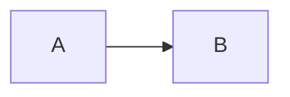
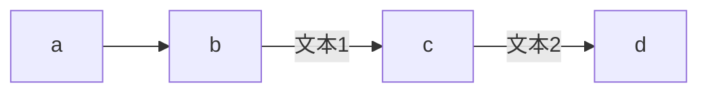
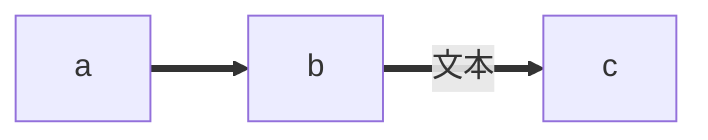

mermaid 可以画：

饼状图：pie  
流程图：graph  
序列图：sequenceDiagram  
甘特图：grantt  
类图：classDiagram  
状态图：stateDiagram  
用户旅程图：journey  


各种图的代码要写在 mermaid 代码块里：

    ```mermaid
        ……流程图代码……
    ```

# 流程图

## 方向

默认是从上打下。

| 关键词      | 含义 |
| ----------- | ----------- |
| TB      | top-->bottom      |
| BT   |         |
| RL   | right-->left       |
| LR   |         |


## 连线样式

#### 实线箭头

线中间无文本就简单了：


    graph LR
    A-->B


效果：



线上有文本有两种写法，两种写法都一样，文本中有多个空格的话只显示一个：

    graph LR
    a-->b--文本  asdf-->c-->|文本2    3|d



### 粗实线箭头

也可以在线中间加文字：

    a==>b==文本==>c



### 虚线箭头

也可以在线中间加文字

