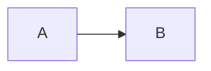
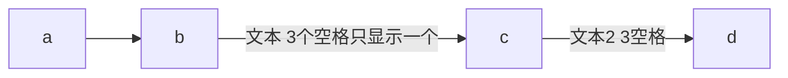
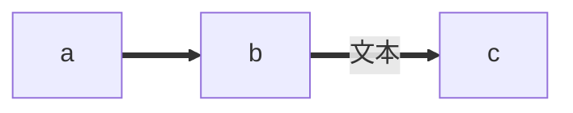
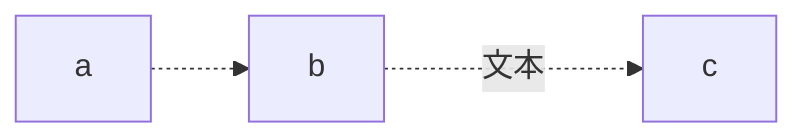
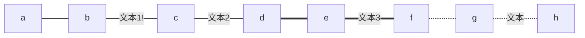
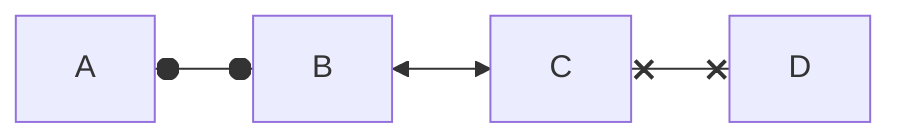
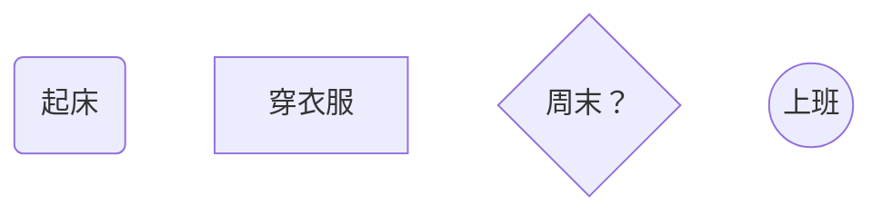
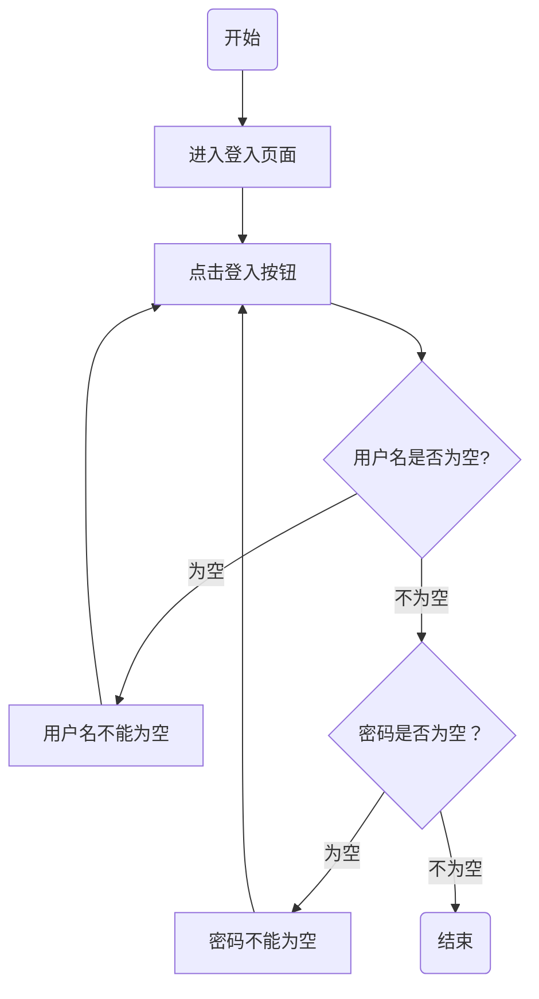

mermaid 可以画：

饼状图：pie  
流程图：graph  
序列图：sequenceDiagram  
甘特图：grantt  
类图：classDiagram  
状态图：stateDiagram  
用户旅程图：journey  


各种图的代码要写在 mermaid 代码块里：

    ```mermaid
        ……代码……
    ```

# 流程图

## 方向

默认是从上打下。

| 关键词      | 含义 |
| ----------- | ----------- |
| TB      | top-->bottom      |
| BT   |         |
| RL   | right-->left       |
| LR   |         |


## 连线样式

#### 实线箭头

    graph LR
    A-->B


效果：



还可以在线上加文本，有两种写法，两种写法都一样，文本中有连续多个空格的话只显示一个：

    graph LR
    a-->b--文本   3个空格只显示一个-->c-->|"文本2   3空格"|d



#### 粗实线箭头

    a==>b====文本==>c



#### 虚线箭头

    graph LR
    a-.->b-.文本.->c


#### 无箭头线

即以上三种连线去掉箭头后的形式



#### 其它样式

将 graph 关键字改为 flowchart，可以多支持三种样式：

    flowchart LR
        A o--o B
        B <--> C
        C x--x D



## 节点

上面示例中的 A, B, C 就是节点, 都是用的默认形状——矩形，还可以指定其它形状：

    graph TB
        A(起床)
        B[穿衣服]
        C{"周末？"}
        D((上班))


用不同类型的括号指定不同的形状；  
括号里面的文字会显示在节点图形中；  
A, B, C 这些是节点 ID —— 方便复用。这里只是举例，所以 ID 命名比较随意，实际使用的时候最好起有意义的名字。

**注意到 C 节点描述内容加了引号，那是因为里面有特殊字符 “？”。**

下面列出所有形状：

    graph
        默认方形
        id1[方形]
        id2(圆边矩形)
        id3([体育场形])
        id4[[子程序形]]
        id5[(圆柱形)]
        id6((圆形))


    graph
        id1{菱形}
        id2{{六角形}}
        id3[/平行四边形/]
        id4[\反向平行四边形\]
        id5[/梯形\]
        id6[\反向梯形/]


#### 复杂一点的例子

